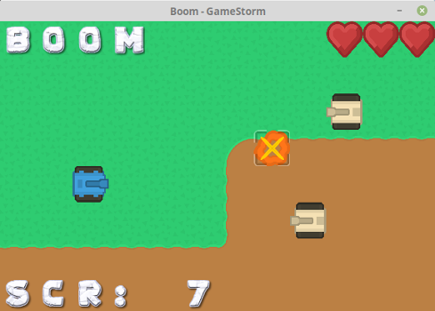
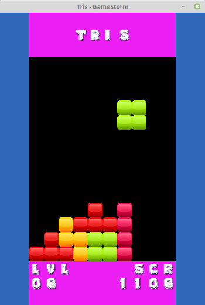
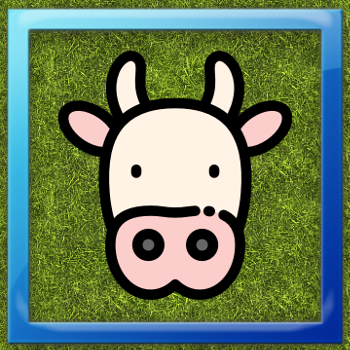
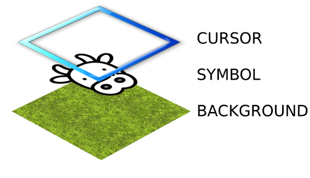
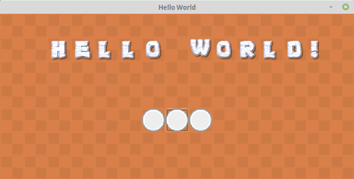

# GameStorm

Welcome!

## What is GameStorm?

GameStorm is a python package - with batteries included - which helps you makes small, grid-based games easily and with very little code. It is built on top of PyGame which is a very flexible and wonderful 2D game engine.

https://www.pygame.org

## Small? Grid-based? Can you show me an example?

Sure! Look at the following picture. It is an example of what you can make using GameStorm.

#### Example 1


#### Example 2


## What does 'batteries included' mean?

That means GameStorm has all you need to make a small game? Sample graphics, text, and sounds are already present. You can use your own, but you don't have to! Also, gamestorm is preconfigured to work with specific keyboard keys as well as gamepads!

## GameStorm seems limited. What is the point?

Good question. GameStorm has three purposes:

1. Learning. GameStorm makes it easy to learn game-programming. In fact, why not learn programming in general with GameStorm? Graphical content can be more fun than text ("Hello World!")
2. Prototyping. GameStorm gives you the ability to prototype a game idea very easily. Sure, the idea will have to use a grid, but many games do; Chess, Tetris, Sokoban. There are many things you can do with a grid and tiles.
3. Fun! It's fun to make games. It's more fun to see your concept on screen quickly than it is to learn to use a fully fledged game engine.

## I'm intrigued. How can I give this a try?

First, install it with pip:

`pip install gamestorm`

Then continue reading the for more detailed instructions. Enjoy!

# GameStorm Documenation

Before looking at any code, you should understand the system and the conventions that GameStorm uses. It's simple and effective.

## The GameStorm 'System'


### Grid

The grid is the visual game area. It takes up the entire window. You can specify how big or small you want it to be. The grid is made up of columns and rows which contain tiles. You don't work much with the grid, other than to set it up. Mainly you work with its tiles.

### Tiles

These are the main resources of the game. Each 'cell' in the grid is a tile. A tile has three major components; a background, a symbol, and a cursor, and they are drawn in that order. You can perform various operations on the tiles and their components. Some examples are:

- Set the background of all the tiles.
- Set the symbol of a specific tile. 
- Clear (remove) the cursor of a specific tile.
- Draw some text starting as a specific tile.
- Clear all the components of all the tiles.

See the [API documentation](https://github.com/agsilvio/gamestorm/blob/master/docs/api.md) for all the methods available concerning tiles.

The following picture contains a diagram of a tile and its components.





The essence of gamestorm is manipulating these components to make a small but fun game. Remember, there are already hundred of sample backgrounds, symbols, and cursors included. So you can use these if you don't want to worry about graphical assets just yet.

### Text

You can draw text ina GameStorm game. It's *very* limited. There is only one font. And each character is drawn to a separate tile. This method was chosen to keep the API as simple as possible. Fortunately, you can draw the text you want, starting at the tile you want, using one simple method.

* Note: Overriding the font is not yet possible, but is coming soon hopefully.

### Drawing / Rendering

Drawing - that is, the actual rendering to the screen - is done deliberately. That means, you manipulate the backgrounds, symbols, and cursors of all the tiles you want, and then you perform the rendering by calling 'draw'. For example, a symbol is not drawn when you set one to a tile. Instead, it will be waiting for you to call 'draw'.

### Input

For input, GameStorm makes use of the keyboard or a gamepad. There are simple methods, for checking when one of the keys/buttons was pressed. For simplicity, the input is limited to the number of buttons that would appear on a SNES gamepad. That means, the keyboard and gamepad are restricted to the following keys:

 Name | Gamepad | Keyboard 
---|---|---
 Up | Up | Up Arrow 
 Down | Down | Down Arrow 
 Left | Left | Left Arrow 
 Right | Right | Right Arrow 
 Button 1 | Button 1 | Key 1 
 Button 2 | Button 2 | Key 2 
 Button 3 | Button 3 | Key 3 
 Button 4 | Button 4 | Key 4 
 Button 5 | Button 5 | Key 5 
 Button 6 | Button 6 | Key 6 
 Select | Select | TAB 
 Start | Start | ENTER 
 Exit | None | ESC 

* Note: Remapping the keys or the gamepad buttons is not yet possible, but is coming soon hopefully.

In no time, you can make a game and use a gamepad to control it!

### SoundFX and Music

In GameStorm, there are two types of sounds: soundfx and music. Music is longer audio that is meant to be played while the game is running. SoundFX are small audio samples that are meant to be played upon certain events. For example, you can play an explosion sound when something in the game is destroyed, or you can play a 'beep' sound when you move the cursor from one tile to another.

GameStorm has a few built-in music tracks and many soundFX so you can put sound in your game right away. You can use your own music and sound if you want to.

### Ready to try?

If you're ready to see some code, then continue reading.

## Code

Let's start with a simple example; our take on Hello World.

```python
import gamestorm

num_tiles_x = 15
num_tiles_y = 7

#these two lines are required
g = gamestorm.GameStorm()
g.init(num_tiles_x, num_tiles_y, tile_size = gamestorm.TileSize.MEDIUM, title = 'Hello World')

#set up some stuff to draw soon!
g.set_all_tiles_background(25)

g.set_tile_symbol(6,4,196)
g.set_tile_symbol(7,4,196)
g.set_tile_symbol(8,4,196)
g.set_tile_cursor(7,4,1)

g.draw_text(2,1, 'Hello World!')

#perform the draw
g.draw()

#check for the exit event to quit
while True:
    events = g.get_events()
    if g.is_exit_button_pressed(events):
        g.quit()
        break
```

That small script will render what's in the following image.



Just as we promised; simple! We will not demonstrate the use of sounds here, but we assure you the API is very straight forward, and you will know how to play sounds just by perusing the [API documentation](https://github.com/agsilvio/gamestorm/blob/master/docs/api.md).


# Conclusion

We hope you enjoy GameStorm. We hope that it helps to inspire students, programmers, makers and more. Enjoy!

